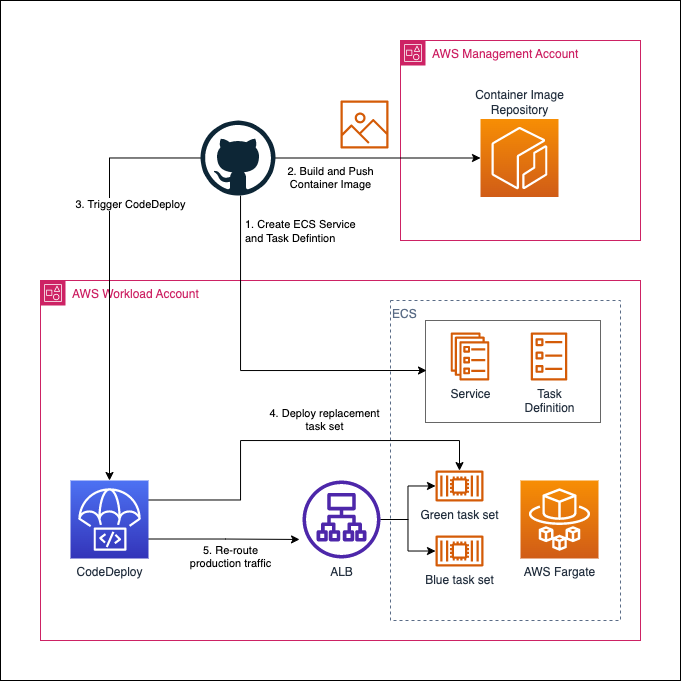

# demo-fargate-app

This repo contains the terraform config to create an ECS service and task definition and a pipeline to build and deploy a container with a simple "Hello World" Java app using Terraform and CodeDeploy.

